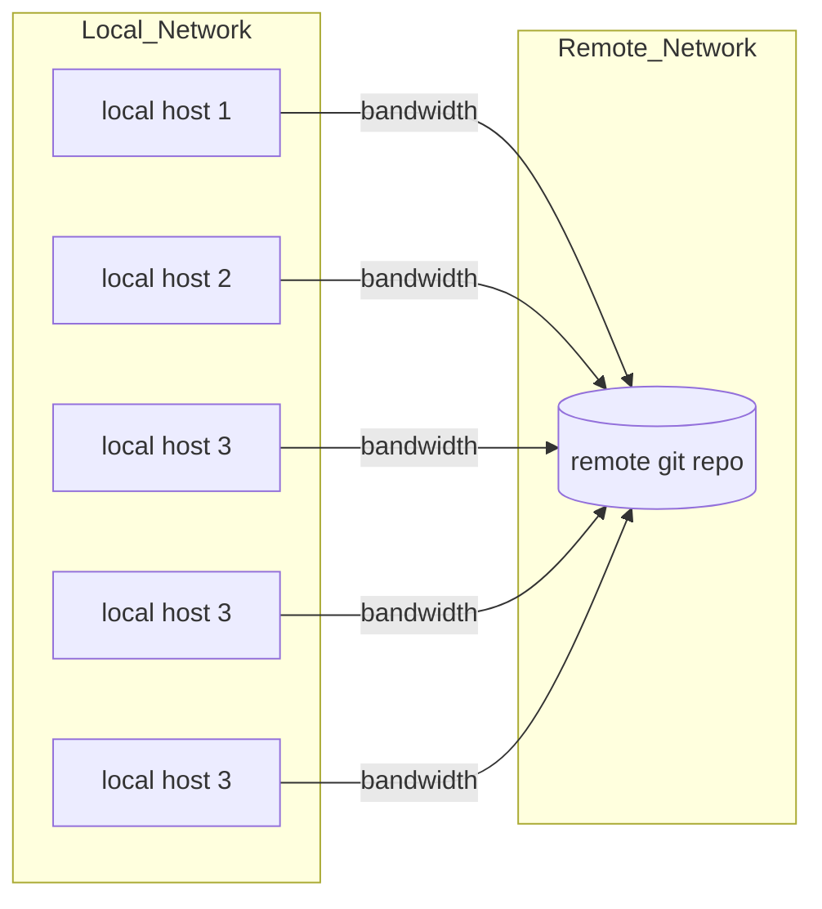
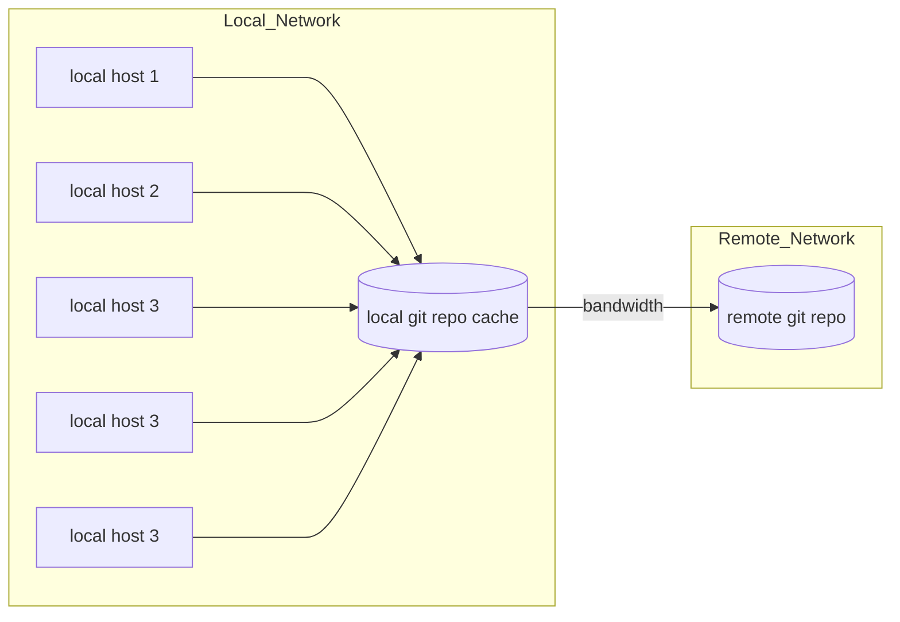

# gitcache
Save bandwidth on duplicate pull requests with a gitcache
# git cache
Create a git cache to SAVE BANDWIDTH

### Purpose
With many local hosts that are frequently grabbing the latest update of a remote git repository, significant bandwith can be saved by having a single, local git repo that is constantly updated with the latest version of the remote repo and the other local hosts usig the local cache for pulls.

Updaes (push) still go to the primary repo, but PR's are performed against the local repo.

### Features
- fully configured via TOML file
- clone non-existant local repo
- verify hash between remote branch and local prior to pull
- option to force new clone on start
- option to share current status page accessible over HTTP

### Requirements
- you must alrady have key based authentication enabled for the user that the script/ service will run under (you dont want your script to be blocked by a login request!)
- Python virtual environment (tested on 3.12+) with installed requirements

### Getting Started
Run the installation script:
```
# clone the repo:
/bin/bash -c "$(curl -fsSL https://raw.githubusercontent.com/davewat/gitcache/refs/heads/main/install.sh)"
```


#### Current State:


#### Future State:
